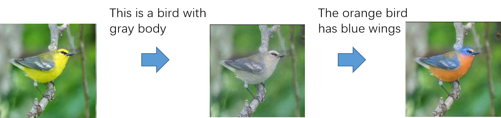
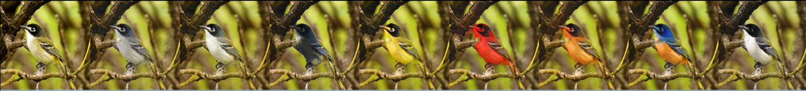

# Residual Attention Generative Adversarial Networks
This is an interesting image-to-image translation that uses the natural language to as guidance information (you can also use the image or label).
In this work, the attention mechanism  similar to AttnGAN [1] is used to manipulate image attributes. By utilizing the Residual block [2]with CBN [3], RAGAN can tranform the image into the scene described by language.

## Dependencies

 - Python 2
 - Pytorch 0.2 or later

 In addition, the pretrained text encoder model and preprocessed data can be found on [AttnGAN](https://github.com/taoxugit/AttnGAN).

## Example

### Example1: unsupervised attributes translation
In this case, the cycle consistency is used to constraint the unsupervised image generation.

As shown above, the first column is the input image and the remaining columns are the generated results guided by different language.

### Example2: supervised image colorization
 In this case, the additional image encoder similar to [4] is used to extract the backgroud information to ensure the completeness of guidance information.

As shown above, the first column contains the input image and its ground truth.The guidance language is fixed in each remaining column. The first row uses the random sample to as backgroud information and the second row uses the backgroud information encoded from  GT.

### Reference
> 1. *Xu T, Zhang P, Huang Q, et al. Attngan: Fine-grained text to image generation with attentional generative adversarial networks[C]. Proc. CVPR. 2018.*
> 2. *He K, Zhang X, Ren S, et al. Deep residual learning for image recognition[C]//Proc. CVPR. 2016.*
> 3. *Yu X, Ying Z, Li T, et al. Multi-Mapping Image-to-Image Translation with Central Biasing Normalization[J]//arXiv preprint arXiv:1806.10050, 2018*
> 4. *Zhu J Y, Zhang R, Pathak D, et al. Toward multimodal image-to-image translation[C]//Advances in Neural Information Processing Systems. 2017: 465-476.*

### Contact
In the begining, I try  to construct an interesting application that can use the text caption from user to indicate image processing. Although RAGAN is still far from my initial ideal, I have to suspend the work due to some "force majeure". If you are interested in this work or have any questions, please feel free to reach me (Xiaoming-Yu@pku.edu.cn).

